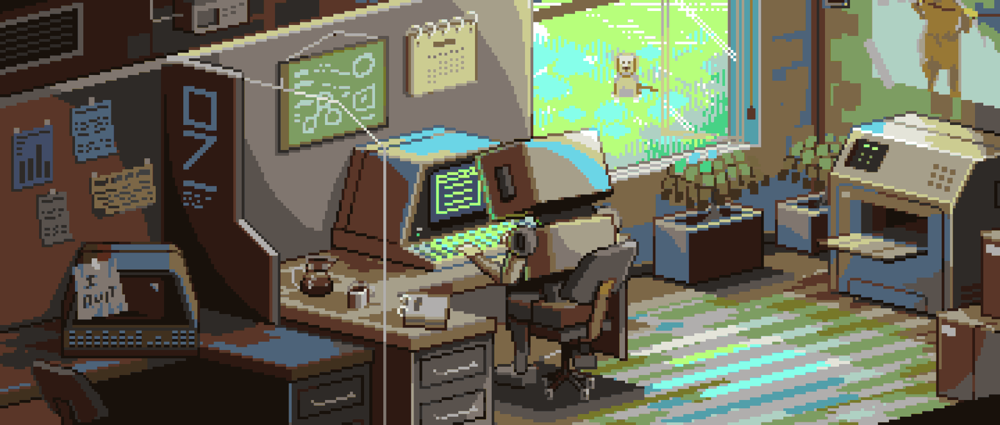

<!--

  

 -->

<h2 align="center"> Hey there! I'm Satyam Singh 👨🏻‍💻</h2>
  

- 🧑🏻‍💻 I'm a Information Technology (IT) Engineer.
- 🕸️ Skilled in both frontend and backend development.
- 😘 Enjoy contributing to and collaborating on open-source projects.
- 🏎️ Passionate about the thrilling world of motorsports,particularly &emsp;Formula 1.

<h3 align="left">💻 Goals for the future:</h3>
<ul>
  <li>Contribute more to open-source projects 🛠️</li>
  <li>Learn a New Technology or Framework 🧑🏻‍💻</li>
  <li>Build innovative and impactful software solutions 🌐</li>
  <li>Start a Tech Blog 🍃</li>
</ul>

<h3 align="left">🌐 Connect with me:</h3>

  
   
  
  

  &nbsp;&nbsp;&nbsp;
  

<h3 align="left">🚀 Languages and Tools:</h3>

  
  
  
  
  
  
  
  
  
  
  
  
  
  
  
  
  

<h3>🧑🏻‍💻 Currently Focused On:</h3>

|  |Venturing into the dynamic landscape of Web 3.0, with a focus on understanding blockchain technology, cryptocurrencies, and the captivating universe of NFTs (Non-Fungible Tokens).Passionate about learning and understanding the potential impact of these innovations on various industries and society as a whole. |
|---|---|

<h3 align="left">😆 Fun Fact:</h3>

I once wrote a script to automatically generate compliments for others code 💻, but it backfired when it started roasting my own code instead.

<h3 align="left">Pickup Line for you:</h3>
<em>"If you were a bug, I'd want you to stay in my code forever, because you're the only one I'd never want to fix."</em>

  <h3 align="left">📊 GitHub Stats:</h3>

  

  
  

